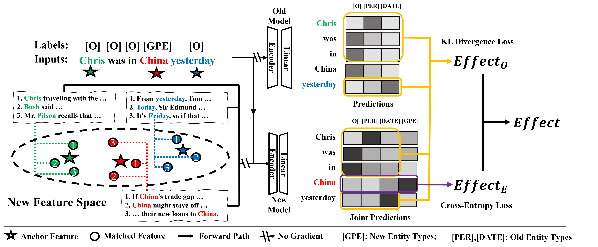

# Distilling Causal Effect from Miscellaneous Other-Class for Continual Named Entity Recognition (EMNLP2022)

This repo provides the source code of our paper: [Distilling Causal Effect from Miscellaneous Other-Class for Continual Named Entity Recognition (EMNLP 2022)](https://arxiv.org/abs/2210.03980).




## Overview of the directory
- *config/* : the directory of configurations for each models
- *datasets/* : the directory of datasets
- *src/* : the directory of the source code
- *main_CL.py* : the python file to be executed
```
.
├── config
│   ├── conll2003
│   ├── ontonotes5
│   ├── i2b2
│   └── default.yaml
├── datasets
│   └── NER_data
│       ├── conll2003
│       ├── i2b2
│       └── ontonotes5
├── main_CL.py
└── src
    ├── config.py
    ├── dataloader.py
    ├── model.py
    ├── trainer.py
    ├── utils_log.py
    ├── utils_plot.py
    └── utils.py
```

### Step 0: Prepare your environments
Reference environment settings:
```
python             3.7.13
torch              1.12.1+cu116
transformers       4.14.1
```

### Step 1: Prepare your data
Download data and preprocess them as the following format (word + \t + NER_tag):
```
SOCCER	O
-	O
JAPAN	B-location
GET	O
LUCKY	O
WIN	O
,	O
CHINA	B-person
IN	O
SURPRISE	O
DEFEAT	O
.	O
```
Then, save the training/testing/developing set to a txt file named *train.txt/test.txt/dev.txt* and move them to the corresponding directory in *./datasets/NER_data/{dataset_name}/*

## Step 2: Split the dataset for continual learning
Take CoNLL2003 as an example:
- specify the arguments of the function *spilt_dataset* in the file *./src/dataloader.py* as follow:
```
if __name__ == "__main__":
   spilt_dataset(['datasets/NER_data/conll2003'], 'train', domain2entity['conll2003'], 1, 1, 'BIO')
   # the parameters nb_class_fg=1 and nb_class_pg=1 represent that the model learns 1 entity in the first CL step and learns 1 entity in the following CL steps.
```

- execute the python file *dataloader.py* as follow:
```
python ./src/dataloader.py
```
Then, the program will split the dataset with the [Greedy Sampling Algorithm](https://arxiv.org/abs/2210.03980) for continual learning and store the split dataset in *train_fg_1_pg_1.pth*.
Note that only training set needs to be split! 

## Step 3: Run main_CL.py
Specify your configurations (e.g., *./config/i2b2/fg_8_pg_2/i2b2_ours.yaml*) and run the following command 
```
python3 main_CL.py --exp_name {your_experiment_name} --exp_id {your_experiment_id} --cfg {your_configuration}
```
Then, the results as well as the model checkpoint will be saved automatically in the directory *./experiments/{your_experiment_name}/{your_experiment_id}/* 

### Experimental results

| **Dataset**    | **Method**    | **FG-1-PG-1** | ****   | **FG-2-PG-2** | ****   | **FG-8-PG-1** | ****   | **FG-8-PG-2** | ****   |
|:--------------:|:-------------:|:-------------:|:------:|:-------------:|:------:|:-------------:|:------:|:-------------:|:------:|
| ****           |               | Mi-F1         | Ma-F1  | Mi-F1         | Ma-F1  | Mi-F1         | Ma-F1  | Mi-F1         | Ma-F1  |
| **I2B2**       | Finetune Only | 17.43         | 13.81  | 28.57         | 21.43  | 20.83         | 18.11  | 23.60         | 23.54  |
| ****           | PODNet        | 12.31         | 17.14  | 34.67         | 24.62  | 39.26         | 27.23  | 36.22         | 26.08  |
| ****           | LUCIR         | 43.86         | 31.31  | 64.32         | 43.53  | 57.86         | 33.04  | 68.54         | 46.94  |
| ****           | ST            | 31.98         | 14.76  | 55.44         | 33.38  | 49.51         | 23.77  | 48.94         | 29.00  |
| ****           | ExtendNER     | 42.85         | 24.05  | 57.01         | 35.29  | 43.95         | 23.12  | 52.25         | 30.93  |
| ****           | CFNER(Ours)   | 62.73         | 36.26  | 71.98         | 49.09  | 59.79         | 37.30  | 69.07         | 51.09  |
| **OntoNotes5** | Finetune Only | 15.27         | 10.85  | 25.85         | 20.55  | 17.63         | 12.23  | 29.81         | 20.05  |
| ****           | PODNet        | 9.06          | 8.36   | 34.67         | 24.62  | 29.00         | 20.54  | 37.38         | 25.85  |
| ****           | LUCIR         | 28.18         | 21.11  | 64.32         | 43.53  | 66.46         | 46.29  | 76.17         | 55.58  |
| ****           | ST            | 50.71         | 33.24  | 68.93         | 50.63  | 73.59         | 49.41  | 77.07         | 53.32  |
| ****           | ExtendNER     | 50.53         | 32.84  | 67.61         | 49.26  | 73.12         | 49.55  | 76.85         | 54.37  |
| ****           | CFNER(Ours)   | 58.94         | 42.22  | 72.59         | 55.96  | 78.92         | 57.51  | 80.68         | 60.52  |

| **Method**        | **FG-1-PG-1** | ****  | **FG-2-PG-1** | ****  |
|:-----------------:|:-------------:|:-----:|:-------------:|:-----:|
| ****              | Mi-F1         | Ma-F1 | Mi-F1         | Ma-F1 |
| **Finetune Only** | 50.84         | 40.64 | 57.45         | 43.58 |
| **PODNet**        | 36.74         | 29.43 | 59.12         | 58.39 |
| **LUCIR**         | 74.15         | 70.48 | 80.53         | 77.33 |
| **ST**            | 76.17         | 72.88 | 76.65         | 66.72 |
| **ExtendNER**     | 76.36         | 73.04 | 76.66         | 66.36 |
| **Ours**          | 80.91         | 79.11 | 80.83         | 75.20 |


If you find the code useful, please consider citing this work
```
Junhao Zheng, Zhanxian Liang, Haibin Chen, and Qianli Ma. 2022. Distilling Causal Effect from Miscellaneous Other-Class for Continual Named Entity Recognition. In Proceedings of the 2022 Conference on Empirical Methods in Natural Language Processing, pages 3602–3615, Abu Dhabi, United Arab Emirates. Association for Computational Linguistics.
```
